# Database Design — Wellness House

**Engine:** MySQL / MariaDB (relational), charset `utf8mb4`. The schema is created and
versioned by **Entity Framework Core migrations** (`wellness-backend/WellnessAPI/Migrations`)
and applied automatically on startup. This document is generated from the live database.

- **Tables:** 27 (19 domain + 8 ASP.NET Identity / EF system)
- **Foreign keys:** 20 enforced relationships
- **Primary keys:** every table (auto-increment surrogate keys on domain tables)
- **Integrity:** FK constraints + unique indexes on business keys + NOT NULL on required columns

## Entity–Relationship Diagram (domain model)

```mermaid
erDiagram
    PaketaWellness ||--o{ Anetaresimet : "PaketId"
    Klientet ||--o{ Anetaresimet : "KlientId"
    Programet ||--o{ KlientProgramet : "ProgramId"
    Klientet ||--o{ KlientProgramet : "KlientId"
    AspNetUsers ||--o{ PasswordResetTokens : "UserId"
    AspNetUsers ||--o{ RefreshTokens : "UserId"
    Produktet ||--o{ ShitjetProduktet : "ProduktId"
    Klientet ||--o{ ShitjetProduktet : "KlientId"
    Terapistet ||--o{ Terminet : "TerapistId"
    Sherbimet ||--o{ Terminet : "SherbimId"
    Klientet ||--o{ Terminet : "KlientId"
    Sherbimet ||--o{ Vlereisimet : "SherbimId"
    Klientet ||--o{ Vlereisimet : "KlientId"
    Terapistet ||--o{ Vlereisimet : "TerapistId"

    Anetaresimet {
        int AnetaresimId PK
        int KlientId FK
        int PaketId FK
        datetime DataFillimit
        datetime DataMbarimit
        longtext Statusi
        decimal CmimiPaguar
    }
    AuditLogs {
        int Id PK
        varchar UserId
        longtext UserEmail
        varchar Action
        varchar Entity
        longtext EntityId
        longtext OldValues
        longtext NewValues
        longtext IpAddress
        datetime CreatedAt
    }
    Furnizuesit {
        int FurnizuesId PK
        varchar Emri
        longtext KontaktPersona
        longtext Email
        longtext Telefoni
        longtext Adresa
        tinyint Aktiv
        datetime DataRegjistrimit
    }
    Klientet {
        int KlientId PK
        varchar Emri
        varchar Mbiemri
        varchar Email UK
        longtext Telefoni
        datetime DataLindjes
        longtext Gjinia
        longtext KushtetShendetesore
        longtext FotoPath
        datetime DataRegjistrimit
    }
    KlientProgramet {
        int KpId PK
        int KlientId FK
        int ProgramId FK
        datetime DataFillimit
        datetime DataMbarimit
        int Progresi
        longtext Statusi
    }
    Lajmerimet {
        int LajmerimId PK
        varchar Titulli
        longtext Permbajtja
        longtext Audienca
        longtext Prioriteti
        datetime DataKrijimit
        datetime DataSkadimit
        tinyint Aktiv
    }
    PaketaWellness {
        int PaketId PK
        varchar EmriPaketes
        longtext Pershkrimi
        longtext SherbimiPerfshire
        decimal Cmimi
        int KohezgjatjaMuaj
        tinyint Aktive
    }
    PasswordResetTokens {
        int Id PK
        varchar UserId FK
        varchar TokenHash UK
        datetime ExpiresAt
        datetime CreatedAt
        datetime UsedAt
    }
    Produktet {
        int ProduktId PK
        varchar EmriProduktit
        longtext Kategoria
        longtext Pershkrimi
        decimal Cmimi
        int SasiaStok
        tinyint Aktiv
    }
    Programet {
        int ProgramId PK
        varchar EmriProgramit
        longtext Pershkrimi
        int KohezgjatjaJave
        longtext Qellimi
        longtext Ushtrimet
        longtext Dieta
    }
    Pushimet {
        int PushimId PK
        int TerapistId
        datetime DataFillimit
        datetime DataMbarimit
        longtext Arsyeja
        varchar Statusi
        datetime DataKerkimit
    }
    RefreshTokens {
        int Id PK
        varchar Token
        datetime ExpiresAt
        datetime CreatedAt
        datetime RevokedAt
        longtext CreatedByIp
        varchar UserId FK
    }
    Sallat {
        int SallaId PK
        varchar Emri UK
        int Kapaciteti
        longtext Tipi
        longtext Pershkrimi
        tinyint Aktive
    }
    Sherbimet {
        int SherbimId PK
        varchar EmriSherbimit
        longtext Kategoria
        longtext Pershkrimi
        int KohezgjatjaMin
        decimal Cmimi
        tinyint Aktiv
    }
    ShitjetProduktet {
        int ShitjeId PK
        int KlientId FK
        int ProduktId FK
        int Sasia
        decimal CmimiTotal
        datetime DataShitjes
        longtext TipiPageses
        longtext StatusiPageses
    }
    Terapistet {
        int TerapistId PK
        varchar Emri
        varchar Mbiemri
        longtext Specializimi
        longtext Licenca
        varchar Email UK
        longtext Telefoni
        tinyint Aktiv
    }
    Terminet {
        int TerminId PK
        int KlientId FK
        int SherbimId FK
        int TerapistId FK
        datetime DataTerminit
        time OraFillimit
        time OraMbarimit
        longtext Statusi
        longtext Shenimet
    }
    Vlereisimet {
        int VleresimId PK
        int KlientId FK
        int SherbimId FK
        int TerapistId FK
        int Nota
        longtext Komenti
        datetime DataVleresimit
    }
    Zbritjet {
        int ZbritjeId PK
        varchar Kodi UK
        decimal PerqindjaZbritjes
        datetime DataFillimit
        datetime DataMbarimit
        int LimitiPerdorimit
        int HereshShfrytezuar
        tinyint Aktive
    }
    AspNetUsers {
        varchar Id PK
        longtext FirstName
        longtext LastName
        datetime CreatedAt
        tinyint IsActive
        longtext KlientId
        longtext Adresa
        varchar UserName
        varchar NormalizedUserName UK
        varchar Email
        varchar NormalizedEmail
        tinyint EmailConfirmed
        longtext PasswordHash
        longtext SecurityStamp
        longtext ConcurrencyStamp
        longtext PhoneNumber
        tinyint PhoneNumberConfirmed
        tinyint TwoFactorEnabled
        datetime LockoutEnd
        tinyint LockoutEnabled
        int AccessFailedCount
    }
```

## Relationships (foreign keys)

| Child table | Column | References | Cardinality |
|---|---|---|---|
| `Anetaresimet` | `PaketId` | `PaketaWellness.PaketId` | many-to-one |
| `Anetaresimet` | `KlientId` | `Klientet.KlientId` | many-to-one |
| `AspNetRoleClaims` | `RoleId` | `AspNetRoles.Id` | many-to-one |
| `AspNetUserClaims` | `UserId` | `AspNetUsers.Id` | many-to-one |
| `AspNetUserLogins` | `UserId` | `AspNetUsers.Id` | many-to-one |
| `AspNetUserRoles` | `UserId` | `AspNetUsers.Id` | many-to-one |
| `AspNetUserRoles` | `RoleId` | `AspNetRoles.Id` | many-to-one |
| `AspNetUserTokens` | `UserId` | `AspNetUsers.Id` | many-to-one |
| `KlientProgramet` | `ProgramId` | `Programet.ProgramId` | many-to-one |
| `KlientProgramet` | `KlientId` | `Klientet.KlientId` | many-to-one |
| `PasswordResetTokens` | `UserId` | `AspNetUsers.Id` | many-to-one |
| `RefreshTokens` | `UserId` | `AspNetUsers.Id` | many-to-one |
| `ShitjetProduktet` | `ProduktId` | `Produktet.ProduktId` | many-to-one |
| `ShitjetProduktet` | `KlientId` | `Klientet.KlientId` | many-to-one |
| `Terminet` | `TerapistId` | `Terapistet.TerapistId` | many-to-one |
| `Terminet` | `SherbimId` | `Sherbimet.SherbimId` | many-to-one |
| `Terminet` | `KlientId` | `Klientet.KlientId` | many-to-one |
| `Vlereisimet` | `SherbimId` | `Sherbimet.SherbimId` | many-to-one |
| `Vlereisimet` | `KlientId` | `Klientet.KlientId` | many-to-one |
| `Vlereisimet` | `TerapistId` | `Terapistet.TerapistId` | many-to-one |

## Indexes & constraints

Unique indexes enforce business keys (unique emails, codes, names); non-unique
indexes accelerate frequent lookups/joins; all foreign keys are enforced constraints.

| Table | Index | Unique | Columns |
|---|---|---|---|
| `Anetaresimet` | `IX_Anetaresimet_KlientId` | no | KlientId |
| `Anetaresimet` | `IX_Anetaresimet_PaketId` | no | PaketId |
| `Anetaresimet` | `PRIMARY` | YES | AnetaresimId |
| `AspNetRoleClaims` | `IX_AspNetRoleClaims_RoleId` | no | RoleId |
| `AspNetRoleClaims` | `PRIMARY` | YES | Id |
| `AspNetRoles` | `PRIMARY` | YES | Id |
| `AspNetRoles` | `RoleNameIndex` | YES | NormalizedName |
| `AspNetUserClaims` | `IX_AspNetUserClaims_UserId` | no | UserId |
| `AspNetUserClaims` | `PRIMARY` | YES | Id |
| `AspNetUserLogins` | `IX_AspNetUserLogins_UserId` | no | UserId |
| `AspNetUserLogins` | `PRIMARY` | YES | LoginProvider,ProviderKey |
| `AspNetUserRoles` | `IX_AspNetUserRoles_RoleId` | no | RoleId |
| `AspNetUserRoles` | `PRIMARY` | YES | UserId,RoleId |
| `AspNetUsers` | `EmailIndex` | no | NormalizedEmail |
| `AspNetUsers` | `PRIMARY` | YES | Id |
| `AspNetUsers` | `UserNameIndex` | YES | NormalizedUserName |
| `AspNetUserTokens` | `PRIMARY` | YES | UserId,LoginProvider,Name |
| `AuditLogs` | `IX_AuditLogs_CreatedAt` | no | CreatedAt |
| `AuditLogs` | `IX_AuditLogs_UserId` | no | UserId |
| `AuditLogs` | `PRIMARY` | YES | Id |
| `Furnizuesit` | `IX_Furnizuesit_Emri` | no | Emri |
| `Furnizuesit` | `PRIMARY` | YES | FurnizuesId |
| `Klientet` | `IX_Klientet_Email` | YES | Email |
| `Klientet` | `PRIMARY` | YES | KlientId |
| `KlientProgramet` | `IX_KlientProgramet_KlientId` | no | KlientId |
| `KlientProgramet` | `IX_KlientProgramet_ProgramId` | no | ProgramId |
| `KlientProgramet` | `PRIMARY` | YES | KpId |
| `Lajmerimet` | `IX_Lajmerimet_DataKrijimit` | no | DataKrijimit |
| `Lajmerimet` | `PRIMARY` | YES | LajmerimId |
| `PaketaWellness` | `PRIMARY` | YES | PaketId |
| `PasswordResetTokens` | `IX_PasswordResetTokens_TokenHash` | YES | TokenHash |
| `PasswordResetTokens` | `IX_PasswordResetTokens_UserId_UsedAt_ExpiresAt` | no | UserId,UsedAt,ExpiresAt |
| `PasswordResetTokens` | `PRIMARY` | YES | Id |
| `Produktet` | `PRIMARY` | YES | ProduktId |
| `Programet` | `PRIMARY` | YES | ProgramId |
| `Pushimet` | `IX_Pushimet_Statusi` | no | Statusi |
| `Pushimet` | `IX_Pushimet_TerapistId` | no | TerapistId |
| `Pushimet` | `PRIMARY` | YES | PushimId |
| `RefreshTokens` | `IX_RefreshTokens_UserId` | no | UserId |
| `RefreshTokens` | `PRIMARY` | YES | Id |
| `Sallat` | `IX_Sallat_Emri` | YES | Emri |
| `Sallat` | `PRIMARY` | YES | SallaId |
| `Sherbimet` | `PRIMARY` | YES | SherbimId |
| `ShitjetProduktet` | `IX_ShitjetProduktet_KlientId` | no | KlientId |
| `ShitjetProduktet` | `IX_ShitjetProduktet_ProduktId` | no | ProduktId |
| `ShitjetProduktet` | `PRIMARY` | YES | ShitjeId |
| `Terapistet` | `IX_Terapistet_Email` | YES | Email |
| `Terapistet` | `PRIMARY` | YES | TerapistId |
| `Terminet` | `IX_Terminet_KlientId` | no | KlientId |
| `Terminet` | `IX_Terminet_SherbimId` | no | SherbimId |
| `Terminet` | `IX_Terminet_TerapistId` | no | TerapistId |
| `Terminet` | `PRIMARY` | YES | TerminId |
| `Vlereisimet` | `IX_Vlereisimet_KlientId_SherbimId` | YES | KlientId,SherbimId |
| `Vlereisimet` | `IX_Vlereisimet_SherbimId` | no | SherbimId |
| `Vlereisimet` | `IX_Vlereisimet_TerapistId` | no | TerapistId |
| `Vlereisimet` | `PRIMARY` | YES | VleresimId |
| `Zbritjet` | `IX_Zbritjet_Kodi` | YES | Kodi |
| `Zbritjet` | `PRIMARY` | YES | ZbritjeId |
| `__EFMigrationsHistory` | `PRIMARY` | YES | MigrationId |

## Domain tables — column reference

### `Anetaresimet`

| Column | Type | Null | Key |
|---|---|---|---|
| `AnetaresimId` | int(11) | NO | PK |
| `KlientId` | int(11) | NO | FK |
| `PaketId` | int(11) | NO | FK |
| `DataFillimit` | datetime(6) | NO |  |
| `DataMbarimit` | datetime(6) | NO |  |
| `Statusi` | longtext | NO |  |
| `CmimiPaguar` | decimal(10,2) | NO |  |

### `AuditLogs`

| Column | Type | Null | Key |
|---|---|---|---|
| `Id` | int(11) | NO | PK |
| `UserId` | varchar(255) | NO |  |
| `UserEmail` | longtext | NO |  |
| `Action` | varchar(50) | NO |  |
| `Entity` | varchar(100) | NO |  |
| `EntityId` | longtext | YES |  |
| `OldValues` | longtext | YES |  |
| `NewValues` | longtext | YES |  |
| `IpAddress` | longtext | YES |  |
| `CreatedAt` | datetime(6) | NO |  |

### `Furnizuesit`

| Column | Type | Null | Key |
|---|---|---|---|
| `FurnizuesId` | int(11) | NO | PK |
| `Emri` | varchar(200) | NO |  |
| `KontaktPersona` | longtext | YES |  |
| `Email` | longtext | YES |  |
| `Telefoni` | longtext | YES |  |
| `Adresa` | longtext | YES |  |
| `Aktiv` | tinyint(1) | NO |  |
| `DataRegjistrimit` | datetime(6) | NO |  |

### `Klientet`

| Column | Type | Null | Key |
|---|---|---|---|
| `KlientId` | int(11) | NO | PK |
| `Emri` | varchar(100) | NO |  |
| `Mbiemri` | varchar(100) | NO |  |
| `Email` | varchar(200) | NO | UNIQUE |
| `Telefoni` | longtext | YES |  |
| `DataLindjes` | datetime(6) | YES |  |
| `Gjinia` | longtext | YES |  |
| `KushtetShendetesore` | longtext | YES |  |
| `FotoPath` | longtext | YES |  |
| `DataRegjistrimit` | datetime(6) | NO |  |

### `KlientProgramet`

| Column | Type | Null | Key |
|---|---|---|---|
| `KpId` | int(11) | NO | PK |
| `KlientId` | int(11) | NO | FK |
| `ProgramId` | int(11) | NO | FK |
| `DataFillimit` | datetime(6) | NO |  |
| `DataMbarimit` | datetime(6) | YES |  |
| `Progresi` | int(11) | NO |  |
| `Statusi` | longtext | NO |  |

### `Lajmerimet`

| Column | Type | Null | Key |
|---|---|---|---|
| `LajmerimId` | int(11) | NO | PK |
| `Titulli` | varchar(250) | NO |  |
| `Permbajtja` | longtext | NO |  |
| `Audienca` | longtext | NO |  |
| `Prioriteti` | longtext | NO |  |
| `DataKrijimit` | datetime(6) | NO |  |
| `DataSkadimit` | datetime(6) | YES |  |
| `Aktiv` | tinyint(1) | NO |  |

### `PaketaWellness`

| Column | Type | Null | Key |
|---|---|---|---|
| `PaketId` | int(11) | NO | PK |
| `EmriPaketes` | varchar(200) | NO |  |
| `Pershkrimi` | longtext | YES |  |
| `SherbimiPerfshire` | longtext | YES |  |
| `Cmimi` | decimal(10,2) | NO |  |
| `KohezgjatjaMuaj` | int(11) | NO |  |
| `Aktive` | tinyint(1) | NO |  |

### `PasswordResetTokens`

| Column | Type | Null | Key |
|---|---|---|---|
| `Id` | int(11) | NO | PK |
| `UserId` | varchar(255) | NO | FK |
| `TokenHash` | varchar(128) | NO | UNIQUE |
| `ExpiresAt` | datetime(6) | NO |  |
| `CreatedAt` | datetime(6) | NO |  |
| `UsedAt` | datetime(6) | YES |  |

### `Produktet`

| Column | Type | Null | Key |
|---|---|---|---|
| `ProduktId` | int(11) | NO | PK |
| `EmriProduktit` | varchar(200) | NO |  |
| `Kategoria` | longtext | YES |  |
| `Pershkrimi` | longtext | YES |  |
| `Cmimi` | decimal(10,2) | NO |  |
| `SasiaStok` | int(11) | NO |  |
| `Aktiv` | tinyint(1) | NO |  |

### `Programet`

| Column | Type | Null | Key |
|---|---|---|---|
| `ProgramId` | int(11) | NO | PK |
| `EmriProgramit` | varchar(200) | NO |  |
| `Pershkrimi` | longtext | YES |  |
| `KohezgjatjaJave` | int(11) | NO |  |
| `Qellimi` | longtext | YES |  |
| `Ushtrimet` | longtext | YES |  |
| `Dieta` | longtext | YES |  |

### `Pushimet`

| Column | Type | Null | Key |
|---|---|---|---|
| `PushimId` | int(11) | NO | PK |
| `TerapistId` | int(11) | NO |  |
| `DataFillimit` | datetime(6) | NO |  |
| `DataMbarimit` | datetime(6) | NO |  |
| `Arsyeja` | longtext | YES |  |
| `Statusi` | varchar(255) | NO |  |
| `DataKerkimit` | datetime(6) | NO |  |

### `RefreshTokens`

| Column | Type | Null | Key |
|---|---|---|---|
| `Id` | int(11) | NO | PK |
| `Token` | varchar(500) | NO |  |
| `ExpiresAt` | datetime(6) | NO |  |
| `CreatedAt` | datetime(6) | NO |  |
| `RevokedAt` | datetime(6) | YES |  |
| `CreatedByIp` | longtext | YES |  |
| `UserId` | varchar(255) | NO | FK |

### `Sallat`

| Column | Type | Null | Key |
|---|---|---|---|
| `SallaId` | int(11) | NO | PK |
| `Emri` | varchar(150) | NO | UNIQUE |
| `Kapaciteti` | int(11) | NO |  |
| `Tipi` | longtext | YES |  |
| `Pershkrimi` | longtext | YES |  |
| `Aktive` | tinyint(1) | NO |  |

### `Sherbimet`

| Column | Type | Null | Key |
|---|---|---|---|
| `SherbimId` | int(11) | NO | PK |
| `EmriSherbimit` | varchar(200) | NO |  |
| `Kategoria` | longtext | YES |  |
| `Pershkrimi` | longtext | YES |  |
| `KohezgjatjaMin` | int(11) | NO |  |
| `Cmimi` | decimal(10,2) | NO |  |
| `Aktiv` | tinyint(1) | NO |  |

### `ShitjetProduktet`

| Column | Type | Null | Key |
|---|---|---|---|
| `ShitjeId` | int(11) | NO | PK |
| `KlientId` | int(11) | NO | FK |
| `ProduktId` | int(11) | NO | FK |
| `Sasia` | int(11) | NO |  |
| `CmimiTotal` | decimal(10,2) | NO |  |
| `DataShitjes` | datetime(6) | NO |  |
| `TipiPageses` | longtext | NO |  |
| `StatusiPageses` | longtext | NO |  |

### `Terapistet`

| Column | Type | Null | Key |
|---|---|---|---|
| `TerapistId` | int(11) | NO | PK |
| `Emri` | varchar(100) | NO |  |
| `Mbiemri` | varchar(100) | NO |  |
| `Specializimi` | longtext | YES |  |
| `Licenca` | longtext | YES |  |
| `Email` | varchar(200) | NO | UNIQUE |
| `Telefoni` | longtext | YES |  |
| `Aktiv` | tinyint(1) | NO |  |

### `Terminet`

| Column | Type | Null | Key |
|---|---|---|---|
| `TerminId` | int(11) | NO | PK |
| `KlientId` | int(11) | NO | FK |
| `SherbimId` | int(11) | NO | FK |
| `TerapistId` | int(11) | NO | FK |
| `DataTerminit` | datetime(6) | NO |  |
| `OraFillimit` | time(6) | NO |  |
| `OraMbarimit` | time(6) | NO |  |
| `Statusi` | longtext | NO |  |
| `Shenimet` | longtext | YES |  |

### `Vlereisimet`

| Column | Type | Null | Key |
|---|---|---|---|
| `VleresimId` | int(11) | NO | PK |
| `KlientId` | int(11) | NO | FK |
| `SherbimId` | int(11) | NO | FK |
| `TerapistId` | int(11) | NO | FK |
| `Nota` | int(11) | NO |  |
| `Komenti` | longtext | YES |  |
| `DataVleresimit` | datetime(6) | NO |  |

### `Zbritjet`

| Column | Type | Null | Key |
|---|---|---|---|
| `ZbritjeId` | int(11) | NO | PK |
| `Kodi` | varchar(50) | NO | UNIQUE |
| `PerqindjaZbritjes` | decimal(5,2) | NO |  |
| `DataFillimit` | datetime(6) | NO |  |
| `DataMbarimit` | datetime(6) | NO |  |
| `LimitiPerdorimit` | int(11) | NO |  |
| `HereshShfrytezuar` | int(11) | NO |  |
| `Aktive` | tinyint(1) | NO |  |

## ASP.NET Identity & system tables

Authentication/authorization uses ASP.NET Core Identity:

- `AspNetRoleClaims`
- `AspNetRoles`
- `AspNetUserClaims`
- `AspNetUserLogins`
- `AspNetUserRoles`
- `AspNetUserTokens`
- `AspNetUsers`
- `__EFMigrationsHistory`
